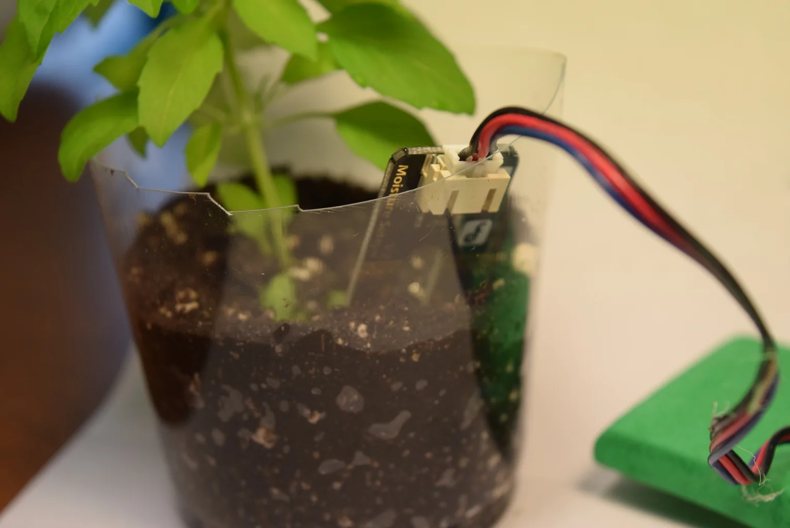
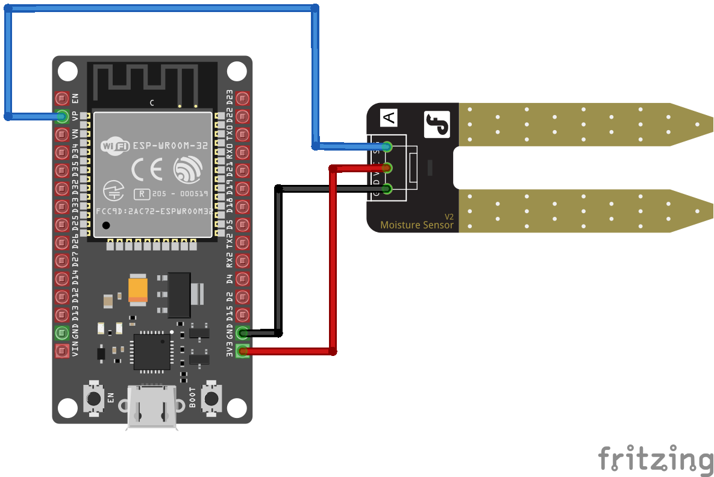

# Demo Agricultura Digital - Planta Inteligente (LabDays EAFIT)

Objetivo: Realizar una aplicación de interconexión de Hardware y Software en el contexto de Agricultura Digital, para monitorear una variable de un sensor de humedad, utilizando el sistema embebido ESP32 y notificando si le falta agua a la planta mediante el LED que trae el ESP32. En resumen realizar una planta inteligente que informa cuando necesita agua.

Es una aplicación muy básica, donde las “cosas” no son inteligentes, sino meramente reactivas al entorno (monitorean el contexto).



## Materiales Requeridos

### Hardware

- [ESP32 Devkit V1](https://didacticaselectronicas.com/index.php/view/productdetails/virtuemart_product_id/9518/virtuemart_category_id/757)
- [Cable de datos micro USB a USB](https://www.didacticaselectronicas.com/index.php/cables/usb/cable-micro-usb-1187-arduino-detail)
- [Sensor de humedad del suelo resistivo](https://www.didacticaselectronicas.com.co/shop/sen0114-sensor-de-humedad-de-suelo-2297?search=sensor+de+humedad&order=name+asc#attr=)
- [Kit cables conector rápido Macho-Hembra (x 10 unidades 20cm)](https://didacticaselectronicas.com/index.php/view/productdetails/virtuemart_product_id/10576/virtuemart_category_id/286)
- Planta

### Software

- [Arduino IDE](https://www.arduino.cc/en/software)
- [Driver ESP32](https://www.silabs.com/developer-tools/usb-to-uart-bridge-vcp-drivers?tab=downloads)
- [Instalar la placa ESP32 en Arduino IDE](https://duino.pro/como-instalar-esp32-en-el-ide-de-arduino-tutorial/)

## Diagrama de Conexión

Inicialmente, asegúrese que el ESP32 se encuentre desconectado del cable USB y de otros elementos en sus pines. Proceda a conectar con 3 cables conector rápido macho – hembra el Sensor de Humedad del Suelo al ESP32 tal como se muestra en figura:

- Conecte el cable Azul del Sensor de Humedad del Suelo a la entrada análoga A0 del ESP32 (pin con la etiqueta “VP” en la tarjeta).
- Conecte el cable Rojo del Sensor de Humedad del Suelo al pin 3V3 del ESP32 (puede usar cualquier pin de la tarjeta que contenga la etiqueta “3V3” ó “3V”).
- Conecte el cable Negro del Sensor de Humedad del Suelo al pin GND del ESP32 (puede usar cualquier pin de la tarjeta que contenga la etiqueta “GND” ó “G”).



## Calibración del sensor

1. Suba el programa `codigoPlantaInteligente.ino` al ESP32 usando el editor de Arduino.

   _Nota: Asegúrese de seleccionar como Board o Placa `DOIT ESP32 DEVKIT V1` y también el puerto correspondiente. Cuando salga en el editor la palabra Connecting.... dejar presionado por unos pocos segundos el botón de `BOOT` del ESP32._

2. Abra el monitor serial en el editor de Arduino (ícono de lupa en la parte superior derecha).

3. Con el sensor en el aire, anote el valor mostrado en el monitor serial del sensor y guardelo como `VAL_SENSOR_AIRE`.

4. Ahora sumerja el sensor en agua hasta máximo las franjas doradas, anote el valor aproximado en el monitor serial y guardelo como `VAL_SENSOR_AGUA`

5. Edite en el código de Arduino tanto en la línea 19 como en la línea 20 con los valores que anotó en los pasos anteriores.

   Ej: Reemplace `XXX` por `VAL_SENSOR_AIRE` y `YYY` por `VAL_SENSOR_AGUA`.

   ```cpp
   #define VAL_SENSOR_AIRE XXX
   #define VAL_SENSOR_AGUA YYY
   ```

6. Descomente la línea 41 del código de Arduino para que se realice la calibración del sensor borrando los `//` al inicio de la línea.

   ```cpp
   //humedad = map(humedad, VAL_SENSOR_AIRE, VAL_SENSOR_AGUA, 0, 100);
   ```

7. Suba nuevamente el programa al ESP32.

8. Abra el monitor serial y observe el valor de humedad que se muestra en cuando sumerge el sensor en el agua y también en el aire. Debe ser 0% en el aire y 100% en el agua.

9. Ahora pruebe con su planta. Si a esta le falta agua, el LED azul del ESP32 encenderá. Si tiene suficiente agua, el LED azul del ESP32 se apagará.
